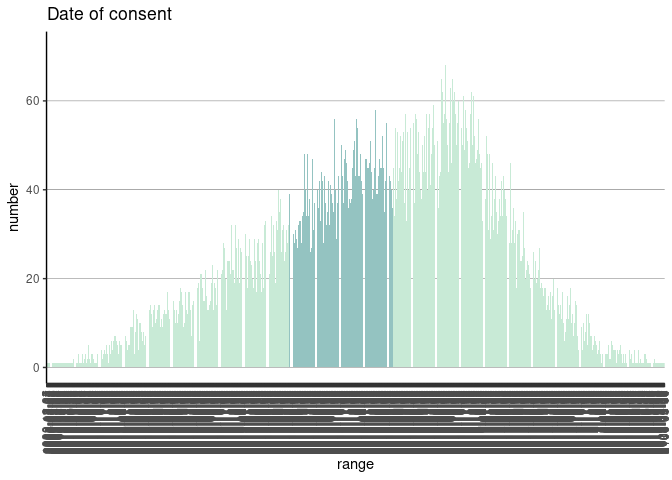
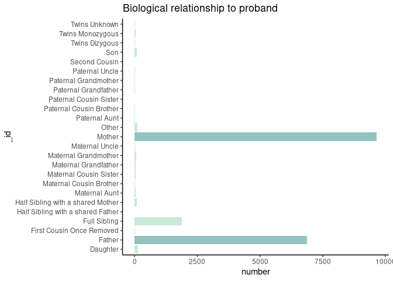

# cloudos 

<!-- README.md is generated from README.Rmd. Please edit that file -->

<!-- badges: start -->

[](https://www.tidyverse.org/lifecycle/#experimental)
[](https://github.com/lifebit-ai/cloudos/actions)
<!-- badges: end -->

**cloudos** R package makes it easy to interact with Lifebit’s CloudOS
<https://cloudos.lifebit.ai/> platform in the R environment.

## Installation

You can install the released version of **cloudos** from
[GitHub](https://github.com/lifebit-ai/cloudos/) at this moment. (Will
be listed on [CRAN](https://CRAN.R-project.org) as well)

``` r
if (!require(remotes)) { install.packages("remotes") }
  remotes::install_github("lifebit-ai/cloudos")
```

## Usage

Bellow are given the demonstration of how the **cloudos** package can be
used.

### Load the library

``` r
library(cloudos)
#> 
#> Welcome to Lifebit's CloudOS R client 
#> For Documentation visit - http://lifebit-ai.github.io/cloudos 
#> This package is under activate development. If you found any issues, 
#> Please reach out here - https://github.com/lifebit-ai/cloudos/issues
```

### Setup login details

To interact with the cloudos server, it require few login details.

Note: If no `base_url` given the default is
<https://cloudos.lifebit.ai/>

``` r
cb_base_url <- "http://cohort-browser-dev-110043291.eu-west-1.elb.amazonaws.com/api"
my_auth <- "your_apikey"
my_team_id <- "your_team_id"
# OR from environment variable stored in a ~/.Renviron file
my_auth <- Sys.getenv("test_cloudos_apikey")
my_team_id <- Sys.getenv("test_cloudos_team_id")
```

### Connect to CloudOS

Lets create a cloudos object with the login details, which can help us
connect to cloudos server.

``` r
my_cloudos <- cloudos::connect_cloudos(base_url = cb_base_url,
                                       auth = my_auth,
                                       team_id = my_team_id)
my_cloudos
#> Base URL:  http://cohort-browser-dev-110043291.eu-west-1.elb.amazonaws.com/api 
#> Authentication Method:  API Key 
#> Team ID: 5f7c8696d6ea46288645a89f
```

## Application - Cohort Browser

Cohort Browser is part of Lifebit’s cloudos offering. Lets explore how
to interact with this in R environment.

### List Cohorts

To check list of available cohorts in a workspace.

``` r
cohorts <- cloudos::cb_list_cohorts(my_cloudos)
#> Total number of cohorts found-31. But here shows-10 as default. For more, change size = 31 to get all.
head(cohorts,5)
#>                         id        name description number_of_participants
#> 1 5f9c5b9213eba60b7174c366         GEL                              44667
#> 2 5f9af7273dd2dc6091cd17d0     damian1                                 46
#> 3 5f9af3793dd2dc6091cd17cd cb_demo_new                               4967
#> 4 5f993a52f8fb2c57d1813c2a        demo                               5537
#> 5 5f9842e1c4c923364b3fac42          f1                              20920
#>   number_of_filters               created_at               updated_at
#> 1                 0 2020-10-30T18:29:38.429Z 2020-10-30T18:29:38.429Z
#> 2                 1 2020-10-29T17:08:55.919Z 2020-11-02T14:50:28.176Z
#> 3                 2 2020-10-29T16:53:13.954Z 2020-11-06T15:18:48.902Z
#> 4                 1 2020-10-28T09:30:58.858Z 2020-11-04T08:44:40.448Z
#> 5                 1 2020-10-27T15:55:13.675Z 2020-10-27T15:55:26.120Z
```

### Create a cohort

To create a new cohort.

``` r
my_cohort <- cloudos::cb_create_cohort(my_cloudos,
                                       cohort_name = "Cohort-R",
                                       cohort_desc = "This cohort is for testing purpose, created from R.")
my_cohort
```

### Get a cohort

Get a available cohort in to a cohort R object. This cohort object can
be used in many different other functions.

``` r
my_cohort <- cloudos::cb_load_cohort(cloudos = my_cloudos, 
                                     cohort_id = "5f9af3793dd2dc6091cd17cd")
my_cohort
#> Cohort ID:  5f9af3793dd2dc6091cd17cd 
#> Cohort Name:  cb_demo_new 
#> Cohort Description:
```

### Get samples table

Get all the samples (participants) table for a cohort with phenotypic
filters applied.

``` r
cohort_samples <- cloudos::cb_get_samples_table(cloudos = my_cloudos, 
                                                cohort = my_cohort)
head(cohort_samples, 5)
#>       EID     Programme         Handling gmc Year of birth
#> 1 1000002 Rare Diseases        West Midlands          1982
#> 2 1000020 Rare Diseases         North Thames          1970
#> 3 1000035 Rare Diseases South West Peninsula          1944
#> 4 1000061 Rare Diseases         North Thames          1971
#> 5 1000522 Rare Diseases Yorkshire and Humber          1990
#>         Participant ethnic category Participant karyotypic sex Participant type
#> 1                    White: British                         Xy         Relative
#> 2                        Not Stated                    Unknown         Relative
#> 3            Mixed: White and Asian               Not Supplied         Relative
#> 4                        Not Stated               Not Supplied         Relative
#> 5 White: Any other White background               Not Supplied         Relative
```

### Get genotypic table

Get all the genotypic table for a cohort.

``` r
#cohort_genotype <- cloudos::cb_get_genotypic_table(my_cloudos, my_cohort)
cohort_genotype <- cloudos::cb_get_genotypic_table(cloudos = my_cloudos)
head(cohort_genotype, 5)
#>   Chromosome   Location Reference Alternative Affimetrix ID
#> 1         10   10:93190        AC                  80278591
#> 2         10   10:94514      CTGG                  52349171
#> 3         10   10:94693         G                  80278592
#> 4         10  10:370955         C           T      89014745
#> 5         10 10:1058556         A           G      92042600
#>   Possible allele combination 0 Possible allele combination 1
#> 1                         GAC G                           0 0
#> 2                     CCTGG CCT                       C CCTGG
#> 3                            AG                           0 0
#> 4                           0 0                           C C
#> 5                           A A                           0 0
#>   Possible allele combination 2 index      Type  id           cn
#> 1                         G GAC     0 Insertion   1   zzg_m_10_0
#> 2                           0 0     3 Insertion   4   zzg_m_10_3
#> 3                           A A     4       SNP   5   zzg_m_10_4
#> 4                           T C    68       SNP  69  zzg_m_10_68
#> 5                           G A   301       SNP 302 zzg_m_10_301
#>                                                                                                                                                                                                                                                                                                                                                                                                                                                                                                                                                                                                                                                                                                                                                                                                                                                                                                                                                                                                                                                                                                                                                                                                                                                                                                                                                                                                                                                                                                                                                                                                                                                                                                                                                                                                                                                                                                                                                                                                                                                                                                                                                                                                                       NA
#> 1                                                                                                                                                                                                                                                                                                                                                                                                                                                                                                                                                                                                                                                                                                                                                                                                                                                                                                                                                                                                                                                                                                                                                                                                                                                                                                                                                                                                                                                                                                                                                                                                                                                                                                                                                                                                                                                                                                                                                                                                                                                                                                                                                                                                                   <NA>
#> 2                                                                                                                                                                                                                                                                                                                                                                                                                                                                                                                                                                                                                                                                                                                                                                                                                                                                                                                                                                                                                                                                                                                                                                                                                                                                                                                                                                                                                                                                                                                                                                                                                                                                                                                                                                                                                                                                                                                                                                                                                                                                                                                                                                                                                   <NA>
#> 3                                                                                                                                                                                                                                                                                                                                                                                                                                                                                                                                                                                                                                                                                                                                                                                                                                                                                                                           GO CYTOSKELETON ORGANIZATION| GO OOGENESIS| GO MICROTUBULE BASED PROCESS| GO MICROTUBULE CYTOSKELETON ORGANIZATION| GO SEXUAL REPRODUCTION| GO ATOMICAL STRUCTURE MATURATION| GO MITOTIC CELL CYCLE| GO ORGANELLE FISSION| GO CELL MATURATION| GO ORGANELLE ASSEMBLY| GO CELLULAR PROCESS INVOLVED IN REPRODUCTION IN MULTICELLULAR ORGANISM| GO OOCYTE MATURATION| GO OOCYTE DIFFERENTIATION| GO MEIOTIC CELL CYCLE| GO CELL CYCLE| GO MULTI ORGANISM REPRODUCTIVE PROCESS| GO GAMETE GENERATION| GO FEMALE GAMETE GENERATION| GO DEVELOPMENTAL PROCESS INVOLVED IN REPRODUCTION| GO MEIOTIC CELL CYCLE PROCESS| GO SPINDLE ASSEMBLY| GO REPRODUCTION| GO GERM CELL DEVELOPMENT| GO MULTICELLULAR ORGANISM REPRODUCTION| GO DEVELOPMENTAL MATURATION| GO CELL CYCLE PROCESS| GO MICROTUBULE CYTOSKELETON| GO CYTOSKELETAL PART| GO MICROTUBULE| GO SPINDLE| GO GTPASE ACTIVITY| GO HYDROLASE ACTIVITY ACTING ON ACID ANHYDRIDES| GO GUANYL NUCLEOTIDE BINDING| GO RIBONUCLEOTIDE BINDING| GO STRUCTURAL CONSTITUENT OF CYTOSKELETON| GO STRUCTURAL MOLECULE ACTIVITY| GO MEIOTIC SPINDLE ORGANIZATION| GO SPINDLE ORGANIZATION| GO FEMALE MEIOTIC NUCLEAR DIVISION| GO SPINDLE ASSEMBLY INVOLVED IN MEIOSIS| GO MEIOTIC SPINDLE| GO SUPRAMOLECULAR COMPLEX| GO POLYMERIC CYTOSKELETAL FIBER
#> 4                                                                                                                                                                                                                                                                                                                                                                                                                                                                                                                                                                                                                                                                                                                                                                                                                                                                                                                                                                                                                                                                                                                                                                                                                                                                                                                                                                                                                                                                                                                                                                                                                                                                                                                                                                                                                                                                                                                                                                                                                                                                                                                                                                                                                   <NA>
#> 5 GO NEGATIVE REGULATION OF PROTEIN MODIFICATION BY SMALL PROTEIN CONJUGATION OR REMOVAL| GO RIBOSOME BIOGENESIS| GO REGULATION OF KISE ACTIVITY| GO NEGATIVE REGULATION OF LOCOMOTION| GO PROTEIN MODIFICATION BY SMALL PROTEIN CONJUGATION OR REMOVAL| GO OSTEOBLAST DIFFERENTIATION| GO NEGATIVE REGULATION OF CELL CELL ADHESION| GO RR METABOLIC PROCESS| GO REGULATION OF TRANSFERASE ACTIVITY| GO CELL MOTILITY| GO CELL CELL ADHESION| GO NCR PROCESSING| GO PROTEIN STABILIZATION| GO MATURATION OF LSU RR| GO REGULATION OF PROTEIN MODIFICATION BY SMALL PROTEIN CONJUGATION OR REMOVAL| GO NCR METABOLIC PROCESS| GO PROTEIN PHOSPHORYLATION| GO NEGATIVE REGULATION OF MOLECULAR FUNCTION| GO REGULATION OF CELL CYCLE| GO LOCOMOTION| GO REGULATION OF PROTEIN STABILITY| GO NEGATIVE REGULATION OF BINDING| GO OSSIFICATION| GO REGULATION OF CELL CELL ADHESION| GO RIBONUCLEOPROTEIN COMPLEX BIOGENESIS| GO CELL CYCLE| GO REGULATION OF CYCLIN DEPENDENT PROTEIN KISE ACTIVITY| GO REGULATION OF CELL ADHESION| GO NEGATIVE REGULATION OF PROTEIN METABOLIC PROCESS| GO REGULATION OF PROTEIN MODIFICATION PROCESS| GO REGULATION OF D REPLICATION| GO NEGATIVE REGULATION OF CELL ADHESION| GO REGULATION OF CELLULAR COMPONENT MOVEMENT| GO REGULATION OF PROTEIN SERINE THREONINE KISE ACTIVITY| GO REGULATION OF BINDING| GO RIBOSOMAL LARGE SUBUNIT BIOGENESIS| GO NEGATIVE REGULATION OF D REPLICATION| GO REGULATION OF PHOSPHORUS METABOLIC PROCESS| GO NEGATIVE REGULATION OF PROTEIN MODIFICATION PROCESS| GO BIOLOGICAL ADHESION| GO D REPLICATION| GO NUCLEAR ENVELOPE| GO PERINUCLEAR REGION OF CYTOPLASM| GO ENVELOPE| GO GOLGI APPARATUS| GO NUCLEOLUS| GO NUCLEAR MEMBRANE| GO GTPASE ACTIVITY| GO HYDROLASE ACTIVITY ACTING ON ACID ANHYDRIDES| GO GUANYL NUCLEOTIDE BINDING| GO RIBONUCLEOTIDE BINDING| GO R BINDING| GO MATURATION OF LSU RR FROM TRICISTRONIC RR TRANSCRIPT SSU RR 5 8S RR LSU RR | GO NEGATIVE REGULATION OF CELL POPULATION PROLIFERATION| GO NEGATIVE REGULATION OF BIOSYNTHETIC PROCESS| GO R METABOLIC PROCESS| GO PROTEIN MODIFICATION BY SMALL PROTEIN CONJUGATION| GO REGULATION OF CELL POPULATION PROLIFERATION| GO NEGATIVE REGULATION OF CELL MOTILITY
#>     NA.1     NA.2 NA.3 NA.4 NA.5 NA.6 NA.7      NA.8 NA.9     NA.10  NA.11
#> 1   <NA>     <NA> <NA> <NA> <NA> <NA> <NA>      <NA> <NA>      <NA>   <NA>
#> 2   <NA>     <NA> <NA> <NA> <NA> <NA> <NA>      <NA> <NA>      <NA>   <NA>
#> 3  TUBB8     <NA> <NA> <NA> <NA> <NA> <NA>      <NA> <NA>      <NA>   <NA>
#> 4  DIP2C 3.23e-05    0    0    0    0    0 6.666e-05    0      <NA>   <NA>
#> 5 GTPBP4     <NA> <NA> <NA> <NA> <NA> <NA>      <NA> <NA> Tolerated Benign
#>    NA.12       NA.13           NA.14   NA.15     NA.16   NA.17     NA.18
#> 1   <NA>        <NA>            <NA>    <NA>      <NA>    <NA>      <NA>
#> 2   <NA>        <NA>            <NA>    <NA>      <NA>    <NA>      <NA>
#> 3   <NA>        <NA>            <NA>    <NA>      <NA>    <NA>      <NA>
#> 4   <NA>        <NA>            <NA>    <NA>      <NA>    <NA>      <NA>
#> 5 Benign Deleterious Disease Causing Neutral Tolerated Neutral Tolerated
#>       NA.19 NA.20 NA.21                                  NA.22 NA.23 NA.24
#> 1      <NA>  <NA>  <NA>                                   <NA>  <NA>  <NA>
#> 2      <NA>  <NA>  <NA>                                   <NA>  <NA>  <NA>
#> 3      <NA>  <NA>  <NA>                                   <NA>  <NA>  <NA>
#> 4      <NA>  <NA>  <NA>                                   <NA>  <NA>  <NA>
#> 5 Tolerated  1062   239 GTPBP4:NM 012341:exon14:cA1496G:pK499R     1     0
#>   NA.25 NA.26 NA.27 NA.28 NA.29 NA.30 NA.31 NA.32  NA.33 NA.34
#> 1  <NA>  <NA>  <NA>  <NA>  <NA>  <NA>  <NA>  <NA>   <NA>  <NA>
#> 2  <NA>  <NA>  <NA>  <NA>  <NA>  <NA>  <NA>  <NA>   <NA>  <NA>
#> 3  <NA>  <NA>  <NA>  <NA>  <NA>  <NA>  <NA>  <NA>   <NA>  <NA>
#> 4  <NA>  <NA>  <NA>  <NA>  <NA>  <NA>  <NA>  <NA>   <NA>  <NA>
#> 5 0.001     0 0.999   0.4  1.64  1.18 0.867 0.216 -1.069 0.037
```

### Explore Filters

#### Search phenotypic filters

Search for phenotypic filters based on a term.

``` r
all_filters <- cloudos::cb_search_phenotypic_filters(cloudos = my_cloudos, 
                                                     term = "cancer")
#> Total number of filters - 4
head(all_filters, 5)
#>   bucket500 bucket1000 bucket2500 bucket5000 bucket300 bucket10000
#> 1     FALSE      FALSE      FALSE      FALSE     FALSE       FALSE
#> 2     FALSE      FALSE      FALSE      FALSE     FALSE       FALSE
#> 3     FALSE      FALSE      FALSE      FALSE     FALSE       FALSE
#> 4     FALSE      FALSE      FALSE      FALSE     FALSE       FALSE
#>   categoryPathLevel1  categoryPathLevel2  id instances
#> 1             Cancer Participant disease 177         1
#> 2             Cancer Participant disease 178         1
#> 3             Cancer  Participant Tumour 190         1
#> 4             Cancer  Participant Tumour 272         1
#>                               name        type Sorting            valueType
#> 1          Cancer disease sub type        bars         Categorical multiple
#> 2              Cancer disease type        bars         Categorical multiple
#> 3                 Cancer tumour sk text_search                         Text
#> 4 Pancreatic cancer clinical stage        bars         Categorical multiple
#>   units coding
#> 1             
#> 2             
#> 3             
#> 4             
#>                                                                                                                                                                                                                                                                                    description
#> 1                                                                                                                                                                                             The subtype of the cancer in question, recorded against a limited set of supplied enumerations. 
#> 2                                                                                                                                                                                                                          The cancer type of the tumour sample submitted to Genomics England.
#> 3                                                                                                                                                                                                                                    Database identifier for a participant's registered tumour
#> 4 COSD UG14560, UPPER GI - STAGING - PANCREAS. Description: 'Clinically agreed stage based on radiological findings of tumour extent in order to offer treatment recommendations. The category selected depends on tumour location within the pancreas and the arterial or venous involvement.
#>   descriptionParticipantsNo
#> 1                     17404
#> 2                     17404
#> 3                      9561
#> 4                      9561
#>                                                              link array
#> 1 https://cnfl.extge.co.uk/pages/viewpage.action?pageId=147659370     4
#> 2 https://cnfl.extge.co.uk/pages/viewpage.action?pageId=147659370     4
#> 3 https://cnfl.extge.co.uk/pages/viewpage.action?pageId=147659370     5
#> 4 https://cnfl.extge.co.uk/pages/viewpage.action?pageId=147659370     5
#>   descriptionStability descriptionCategoryID descriptionItemType
#> 1                                                               
#> 2                                                               
#> 3                                                               
#> 4                                                               
#>     descriptionStrata descriptionSexed orderPhenotype instance0Name
#> 1 Main 100k Programme                                              
#> 2 Main 100k Programme                                              
#> 3 Main 100k Programme                                              
#> 4 Main 100k Programme                                              
#>   instance1Name instance2Name instance3Name instance4Name instance5Name
#> 1                                                                      
#> 2                                                                      
#> 3                                                                      
#> 4                                                                      
#>   instance6Name instance7Name instance8Name instance9Name instance10Name
#> 1                                                                       
#> 2                                                                       
#> 3                                                                       
#> 4                                                                       
#>   instance11Name instance12Name instance13Name instance14Name instance15Name
#> 1                                                                           
#> 2                                                                           
#> 3                                                                           
#> 4                                                                           
#>   instance16Name
#> 1               
#> 2               
#> 3               
#> 4
```

Lets choose one filter from above table

``` r
# apply this first row filter
my_phenotypic_filter <- all_filters[1,]
my_phenotypic_filter
#>   bucket500 bucket1000 bucket2500 bucket5000 bucket300 bucket10000
#> 1     FALSE      FALSE      FALSE      FALSE     FALSE       FALSE
#>   categoryPathLevel1  categoryPathLevel2  id instances                    name
#> 1             Cancer Participant disease 177         1 Cancer disease sub type
#>   type Sorting            valueType units coding
#> 1 bars         Categorical multiple             
#>                                                                                        description
#> 1 The subtype of the cancer in question, recorded against a limited set of supplied enumerations. 
#>   descriptionParticipantsNo
#> 1                     17404
#>                                                              link array
#> 1 https://cnfl.extge.co.uk/pages/viewpage.action?pageId=147659370     4
#>   descriptionStability descriptionCategoryID descriptionItemType
#> 1                                                               
#>     descriptionStrata descriptionSexed orderPhenotype instance0Name
#> 1 Main 100k Programme                                              
#>   instance1Name instance2Name instance3Name instance4Name instance5Name
#> 1                                                                      
#>   instance6Name instance7Name instance8Name instance9Name instance10Name
#> 1                                                                       
#>   instance11Name instance12Name instance13Name instance14Name instance15Name
#> 1                                                                           
#>   instance16Name
#> 1
```

#### Apply phenotypic filter

We can get statistic of sample numbers in a cohort for which a filter is
applied.

``` r
# phenotype filter
cohort_with_filters <- cloudos::cb_get_filter_statistics(my_cloudos, 
                                     cohort = my_cohort, 
                                     filter_id = my_phenotypic_filter$id)
cohort_with_filters
#> # A tibble: 85 x 3
#>    `_id`                               number total
#>    <chr>                                <int> <int>
#>  1 (All) Acute Lymphoblastic Leukaemia     46  4449
#>  2 (Aml) Acute Myeloid Leukaemia           55  4449
#>  3 Acral Lentiginous                        1  4449
#>  4 Adamantinoma Of Bone                     7  4449
#>  5 Adenocarcinoma                         982  4449
#>  6 Anaplastic Astrocytoma                  11  4449
#>  7 Anaplastic Oligodendroglioma             5  4449
#>  8 Angiosarcoma                             3  4449
#>  9 Biliary Adenocarcinoma                   1  4449
#> 10 Carcinosarcoma                          12  4449
#> # … with 75 more rows
```

We can get number of total participants after applying a filter.

``` r
# filter participants
total_participants_with_filter <- cloudos:::cb_filter_participants(my_cloudos,
                                                cohort = my_cohort, 
                                                filter_id = my_phenotypic_filter$id)
 
total_participants_with_filter
#> $total
#> [1] 44667
#> 
#> $count
#> [1] 0
```

### Apply and Save a filter

Save a filter into the database.

For this a `filter_query` is required.

`filter_query` is a list of different **phenotypic filter** quires.

Steps to find phenotypic filters -

  - Use `cb_search_phenotypic_filters()` to find a filter based on a
    term.
  - At this time you will be having phenotypic filter id of your choice.
  - Check the available filter values/range using
    `cb_get_filter_statistics()`
  - Now use this information to make your `filter_query`

There are two possible type of `filter_query`

  - Range based
  - Value based

**Range based**

For filter\_id = 22

``` r
# A tibble: 1,880 x 3
   `_id`      number total
   <chr>       <int> <int>
 1 1938-12-25      1 44660
 2 1998-07-07      1 44660
 3 2000-12-04      1 44660
 4 2003-12-24      1 44660
 5 2004-07-20      1 44660
 6 2004-10-21      1 44660
 7 2004-11-01      1 44660
 8 2004-11-03      1 44660
 9 2005-01-07      1 44660
10 2005-02-27      1 44660
# … with 1,870 more rows
```

To make a range based query - `filter_query = list("22" = list("from" =
"2015-05-13", "to" = "2016-04-29")`

Here `"22"` is the filter\_id and you need to provide the range as a
list with `from` and `to`.

**Value based**

For filter\_id = 50

``` r
# A tibble: 25 x 3
   `_id`                             number total
   <chr>                              <int> <int>
 1 Daughter                             135 19187
 2 Father                              6864 19187
 3 First Cousin Once Removed             11 19187
 4 Full Sibling                        1876 19187
 5 Half Sibling with a shared Father      4 19187
 6 Half Sibling with a shared Mother     79 19187
 7 Maternal Aunt                         49 19187
 8 Maternal Cousin Brother               12 19187
 9 Maternal Cousin Sister                34 19187
10 Maternal Grandfather                  36 19187
11 Maternal Grandmother                  68 19187
12 Maternal Uncle                        27 19187
13 Mother                              9649 19187
14 Other                                114 19187
```

To make a value based query \<- `filter_query = list("50" = c("Father",
"Mother"))`

Here `"50"` is filter\_id and `c("Father", "Mother")` is a vector of
values.

If you have multiple `filter_query` you can combine them with separated
by a coma `,` inside the list. Such as `filter_query =
list(filter_query_1, filter_query_2)`

Check the bellow example for the complete function call.

``` r
cb_apply_filter(cloudos = my_cloudos,
                cohort = my_cohort,
                filter_query = list("22" = list("from" = "2015-05-13", "to" = "2016-04-29"), "50" = c("Father", "Mother")))
```

### Get sample filters plot

Get ggplots for all the applied phenotypic filters for a cohort.

As this based on ggplot objects, this can be customised further.

``` r
plot_list <- cloudos::cb_plot_filters(cloudos = my_cloudos, cohort = my_cohort)
#> Warning: Ignoring unknown parameters: binwidth, bins, pad
library(ggpubr)
#> Loading required package: ggplot2
ggpubr::ggarrange(plotlist = plot_list)
```


Individual plots

``` r
plot_list[[1]]
```



``` r
plot_list[[2]]
```



Covert ggplot objects to plotly elements (just for demonstration
purpose, in markdown plotly don’t support.)

``` r
p1 <- plotly::ggplotly(plot_list$filter_id_34)
p1
```

``` r
p2 <- plotly::ggplotly(plot_list$filter_id_2345)
p2
```

### Additional for UI

#### Get samples table for selected rows

Create a RAW data string. This usually generates after selecting
participants on UI. (more information will be added how to create this
in R)

NOTE: This function will be improved `raw_data` arg is temporary.

``` r
new_raw_data <- '{"columns":[{"id":34,"instance":0,"array":{"type":"exact","value":0}},{"id":31,"instance":0,"array":{"type":"exact","value":0}},{"id":52,"instance":0,"array":{"type":"exact","value":0}},{"id":5984,"instance":0,"array":{"type":"avg"}},{"id":5984,"instance":0,"array":{"type":"min"}},{"id":5984,"instance":0,"array":{"type":"max"}},{"id":20001,"instance":0,"array":{"type":"exact","value":0}}],"ids":["5f185b92bf92ed4d3be9637d","5edbdd689d700db709af0c2f","5f185b91bf92ed4d3be9587e","5f185b91bf92ed4d3be95984","5edbdd689d700db709af0c3e","5edbdd689d700db709af0c2b","5edbdd689d700db709af0c2d","5f185b93bf92ed4d3be982e9","5edbdd689d700db709af0c2a","5edbdd689d700db709af0c4d"],"type":"csv","base_url":"http://cohort-browser-766010452.eu-west-1.elb.amazonaws.com"}'
```

Using this above raw data lets extract selected participants.

``` r
df <- cloudos::cb_extract_samples(my_cloudos,
                      raw_data = new_raw_data)
```
