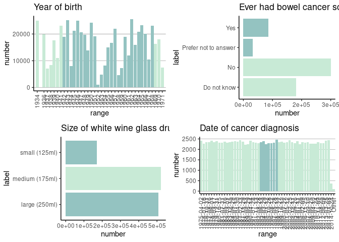
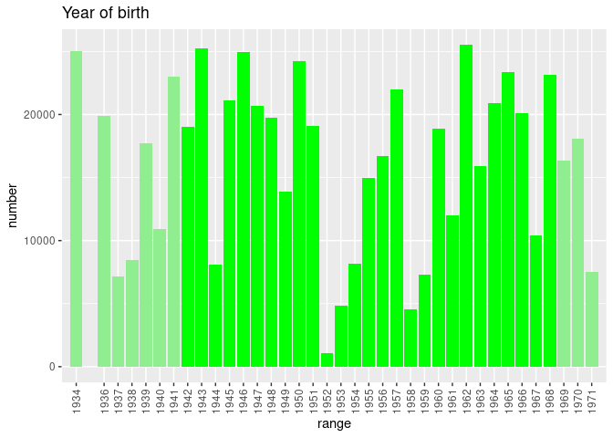
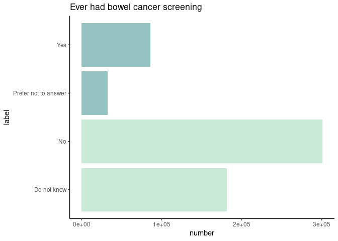

# cloudos 

<!-- README.md is generated from README.Rmd. Please edit that file -->

<!-- badges: start -->

[](https://www.tidyverse.org/lifecycle/#experimental)
[](https://github.com/lifebit-ai/cloudos/actions)
<!-- badges: end -->

**cloudos** R package makes it easy to interact with Lifebit’s CloudOS
<https://cloudos.lifebit.ai/> platform in the R environment.

## Installation

You can install the released version of **cloudos** from
[GitHub](https://github.com/lifebit-ai/cloudos/) at this moment. (Will
be listed on [CRAN](https://CRAN.R-project.org) as well)

``` r
if (!require(remotes)) { install.packages("remotes") }
  remotes::install_github("lifebit-ai/cloudos")
```

## Usage

Bellow are given the demonstration of how the **cloudos** package can be
used.

### Load the library

``` r
library(cloudos)
```

### Setup login details

To interact with the cloudos server, it require few login details.

Note: If no `base_url` given the default is
<https://cloudos.lifebit.ai/>

``` r
cb_base_url <- "http://cohort-browser-766010452.eu-west-1.elb.amazonaws.com/api"
my_auth <- "your_apikey"
my_team_id <- "your_team_id"
# OR from environment variable stored in a ~/.Renviron file
my_auth <- Sys.getenv("test_cloudos_apikey")
my_team_id <- Sys.getenv("test_cloudos_team_id")
```

### Connect to CloudOS

Lets create a cloudos object with the login details, which can help us
connect to cloudos server.

``` r
my_cloudos <- cloudos::connect_cloudos(base_url = cb_base_url,
                                       auth = my_auth,
                                       team_id = my_team_id)
my_cloudos
#> Base URL:  http://cohort-browser-766010452.eu-west-1.elb.amazonaws.com/api 
#> Authentication Method:  API Key 
#> Team ID: 5f046bf6c132dd15fdd1a525
```

## Application - Cohort Browser

Cohort Browser is part of Lifebit’s cloudos offering. Lets explore how
to interact with this in R environment.

### List Cohorts

To check list of available cohorts in a workspace.

``` r
cohorts <- cloudos::cb_list_cohorts(my_cloudos)
#> Total number of cohorts found-58. But here is 10. For more, change 'page_number' and 'page_size'
head(cohorts,5)
#>                         id                name
#> 1 5f75a6fad160a62557e313a0      cb-stress-test
#> 2 5f73456e79721e542d5bea37 Cohort-R-to-compare
#> 3 5f68c6a0e95ca00b6918a2e9            Cohort-R
#> 4 5f6228133097cc7a6504fb76       cohort-test-2
#> 5 5f6227f285aae86f12fa9af9  test-cohort0-r-lib
#>                                           description number_of_participants
#> 1                                                                     481862
#> 2                                                                       2329
#> 3 This cohort is for testing purpose, created from R.                 486709
#> 4                                For testing in R-lib                   4434
#> 5                                   For testing R-lib                 644686
#>   number_of_filters               created_at               updated_at
#> 1                 1 2020-10-01T09:52:58.011Z 2020-10-09T09:14:51.125Z
#> 2                 3 2020-09-29T14:32:14.048Z 2020-10-09T08:42:06.218Z
#> 3                 4 2020-09-21T15:28:32.659Z 2020-10-12T10:00:47.866Z
#> 4                 4 2020-09-16T14:58:27.928Z 2020-09-28T11:18:31.430Z
#> 5                 0 2020-09-16T14:57:54.643Z 2020-09-16T14:57:54.643Z
```

### Create a cohort

To create a new cohort.

``` r
my_cohort <- cloudos::cb_create_cohort(my_cloudos,
                                       cohort_name = "Cohort-R",
                                       cohort_desc = "This cohort is for testing purpose, created from R.")
my_cohort
```

### Get a cohort

Get a available cohort in to a cohort R object. This cohort object can
be used in many different other functions.

``` r
my_cohort <- cloudos::cb_load_cohort(cloudos = my_cloudos, 
                                     cohort_id = "5f6228133097cc7a6504fb76")
my_cohort
#> Cohort ID:  5f6228133097cc7a6504fb76 
#> Cohort Name:  cohort-test-2 
#> Cohort Description:  For testing in R-lib
```

### Get samples table

Get all the samples (participants) table for a cohort with phenotypic
filters applied.

``` r
cohort_samples <- cloudos::cb_get_samples_table(cloudos = my_cloudos, 
                                                cohort = my_cohort)
head(cohort_samples, 5)
#>         i               f20001i0a0 f31i0a0 f34i0a0   f52i0a0      f5984i0aavg
#> 1 1000184 non-melanoma skin cancer  Female    1957   January 62.5803571428571
#> 2 1001600      nasal cavity cancer  Female    1968 September 68.7105263157895
#> 3 1002915      nasal cavity cancer  Female    1950     March 58.8495575221239
#> 4 1004792       parathyroid cancer    Male    1959  November 66.7456140350877
#> 5 1008748           trachea cancer  Female    1959     April 61.3035714285714
#>   f5984i0amin f5984i0amax
#> 1           1         270
#> 2           1         270
#> 3           2         270
#> 4           2         270
#> 5           2         245
```

### Get sample filters plot

Get ggplots for all the applied phenotypic filters for a cohort.

As this based on ggplot objects, this can be customised further.

``` r
plot_list <- cloudos::cb_plot_filters(cloudos = my_cloudos, cohort = my_cohort)
#> Warning: Ignoring unknown parameters: binwidth, bins, pad
#> Warning: Continuous limits supplied to discrete scale.
#> Did you mean `limits = factor(...)` or `scale_*_continuous()`?
#> Warning: Ignoring unknown parameters: binwidth, bins, pad
library(ggpubr)
#> Loading required package: ggplot2
ggpubr::ggarrange(plotlist = plot_list)
```



Individual plots

``` r
plot_list[[1]]
```



``` r
plot_list[[2]]
```



Covert ggplot objects to plotly elements (just for demonstration
purpose, in markdown plotly don’t support.)

``` r
p1 <- plotly::ggplotly(plot_list$filter_id_34)
p1
```

``` r
p2 <- plotly::ggplotly(plot_list$filter_id_2345)
p2
```

### Get genotypic table

Get all the genotypic table for a cohort.

``` r
#cohort_genotype <- cloudos::cb_get_genotypic_table(my_cloudos, my_cohort)
cohort_genotype <- cloudos::cb_get_genotypic_table(cloudos = my_cloudos)
head(cohort_genotype, 5)
#>   index Chromosome    Location Reference Alternative                Gene
#> 1    12          1 1:100011443         G           T AC118553.2; SLC35A3
#> 2     2          1 1:100007041         A           G AC118553.2; SLC35A3
#> 3     1          1 1:100007040         T           G AC118553.2; SLC35A3
#> 4    13          1 1:100015306         C           A AC118553.2; SLC35A3
#> 5    14          1 1:100015331         G           A AC118553.2; SLC35A3
#>           cn
#> 1 zzg_m_1_12
#> 2  zzg_m_1_2
#> 3  zzg_m_1_1
#> 4 zzg_m_1_13
#> 5 zzg_m_1_14
```

### Filtering

#### Search phenotypic filters

Search for phenotypic filters based on a term.

``` r
all_filters <- cloudos::cb_search_phenotypic_filters(cloudos = my_cloudos, 
                                                     term = "cancer")
#> Total number of filters - 29
head(all_filters, 5)
#>             categoryPathLevel1 categoryPathLevel2         categoryPathLevel3
#> 1 UK Biobank Assessment Centre        Touchscreen Health and medical history
#> 2 UK Biobank Assessment Centre        Touchscreen Health and medical history
#> 3 UK Biobank Assessment Centre        Touchscreen Health and medical history
#> 4 UK Biobank Assessment Centre        Touchscreen       Sex-specific factors
#> 5 UK Biobank Assessment Centre        Touchscreen       Sex-specific factors
#>        categoryPathLevel4   id
#> 1        Cancer screening 2345
#> 2        Cancer screening 2355
#> 3      Medical conditions 2453
#> 4 Female-specific factors 2674
#> 5 Female-specific factors 2684
#>                                                   name      type
#> 1                      Ever had bowel cancer screening      bars
#> 2                   Most recent bowel cancer screening histogram
#> 3                           Cancer diagnosed by doctor      bars
#> 4         Ever had breast cancer screening / mammogram      bars
#> 5 Years since last breast cancer screening / mammogram histogram
#>            valueType units instances array
#> 1 Categorical single               4     1
#> 2            Integer years         4     1
#> 3 Categorical single               4     1
#> 4 Categorical single               4     1
#> 5            Integer years         4     1
#>                                                                                                                                                                                                                                                                                                                                                                                                                                                                                                                                                                                                                                                                                                                                                                                                                                                                                                                                          description
#> 1 "ACE touchscreen question ""Have you ever had a screening test for bowel (colorectal) cancer? (Please include tests for blood in the stool/faeces or a colonoscopy or a sigmoidoscopy)"" If the participant activated the Help button they were shown the message:     Screening tests for bowel or colorectal cancer include:  - FOBT (faecal occult blood test) - this is when you    are given a set of cards and asked to smear a part    of your stool on three separate occasions onto the    cards and then return the cards to be tested for    blood.  - Sigmoidoscopy - a tube is used to examine the lower    bowel. This is usually done in a doctor's office    without pain relief.  - Colonoscopy - a long tube is used the examine the    whole large bowel; you would usually have to drink    a large amount of special liquid to prepare the    bowel; and you would be given a sedative medication    for the procedure.     "
#> 2                                                                                                                                                                                                                                                                                                                                                                          "ACE touchscreen question ""How many years ago was the most recent one of these tests?"" The following checks were performed:  If answer   If answer > Participants age - 5 years then rejected  If answer > 20 then participant asked to confirm   If the participant activated the Help button they were shown the message:     If you are unsure; please provide an estimate or select Do not know.      ~F2355~ was collected from participants who indicated they have had a screening test for bowel (colorectal) cancer; as indicated by their answers to ~F2345~"
#> 3                                                                                                                                                                                                                                                                                                                                                                                                                                                                                                                                                                                                                      "ACE touchscreen question ""Has a doctor ever told you that you have had cancer?"" If the participant activated the Help button they were shown the message:     If you are unsure if you have been told you had cancer; select Do not know and you will be asked about this by an interviewer later during this visit.     "
#> 4                                                                                                                                                                                                                                                                                                                                                                                                                                                                                                                                                                                                                                                                                                                                                                                                                                                       "ACE touchscreen question ""Have you ever been for breast cancer screening (a mammogram)?"""
#> 5                                                                                                                                                                                                                                                                                                                                                                                                                              "ACE touchscreen question ""How many years ago was your last screen?"" The following checks were performed:  If answer   If answer > Participants age - 15 years then rejected  If answer > 15 then participant asked to confirm   If the participant activated the Help button they were shown the message:     If you are unsure; please provide an estimate or select Do not know.      ~F2684~ was collected from women who indicated that they had been for a mammogram; as defined by their answers to ~F2674~"
#>   descriptionParticipantsNo descriptionItemNo descriptionStability coding
#> 1                    501599            572225             Complete 100349
#> 2                    180035            202611             Complete 100567
#> 3                    501592            572218             Complete 100603
#> 4                    272921            309271             Complete 100349
#> 5                    223188            252179             Complete 100567
#>   descriptionCategoryID descriptionItemType descriptionStrata descriptionSexed
#> 1                100040                Data           Primary           Unisex
#> 2                100040                Data           Primary           Unisex
#> 3                100044                Data           Primary           Unisex
#> 4                100069                Data           Primary           Female
#> 5                100069                Data           Primary           Female
#>                                                      link
#> 1 http://biobank.ctsu.ox.ac.uk/showcase/field.cgi?id=2345
#> 2 http://biobank.ctsu.ox.ac.uk/showcase/field.cgi?id=2355
#> 3 http://biobank.ctsu.ox.ac.uk/showcase/field.cgi?id=2453
#> 4 http://biobank.ctsu.ox.ac.uk/showcase/field.cgi?id=2674
#> 5 http://biobank.ctsu.ox.ac.uk/showcase/field.cgi?id=2684
#>                                                                                 instance0Name
#> 1 Initial assessment visit (2006-2010) at which participants were recruited and consent given
#> 2 Initial assessment visit (2006-2010) at which participants were recruited and consent given
#> 3 Initial assessment visit (2006-2010) at which participants were recruited and consent given
#> 4 Initial assessment visit (2006-2010) at which participants were recruited and consent given
#> 5 Initial assessment visit (2006-2010) at which participants were recruited and consent given
#>                             instance1Name         instance2Name
#> 1 First repeat assessment visit (2012-13) Imaging visit (2014+)
#> 2 First repeat assessment visit (2012-13) Imaging visit (2014+)
#> 3 First repeat assessment visit (2012-13) Imaging visit (2014+)
#> 4 First repeat assessment visit (2012-13) Imaging visit (2014+)
#> 5 First repeat assessment visit (2012-13) Imaging visit (2014+)
#>                        instance3Name instance4Name instance5Name instance6Name
#> 1 First repeat imaging visit (2019+)                                          
#> 2 First repeat imaging visit (2019+)                                          
#> 3 First repeat imaging visit (2019+)                                          
#> 4 First repeat imaging visit (2019+)                                          
#> 5 First repeat imaging visit (2019+)                                          
#>   instance7Name instance8Name instance9Name instance10Name instance11Name
#> 1                                                                        
#> 2                                                                        
#> 3                                                                        
#> 4                                                                        
#> 5                                                                        
#>   instance12Name instance13Name instance14Name instance15Name instance16Name
#> 1                                                                           
#> 2                                                                           
#> 3                                                                           
#> 4                                                                           
#> 5                                                                           
#>   bucket300 bucket500 bucket1000 bucket2500 bucket5000 bucket10000
#> 1     FALSE     FALSE      FALSE      FALSE      FALSE       FALSE
#> 2     FALSE     FALSE      FALSE      FALSE      FALSE       FALSE
#> 3     FALSE     FALSE      FALSE      FALSE      FALSE       FALSE
#> 4     FALSE     FALSE      FALSE      FALSE      FALSE       FALSE
#> 5     FALSE     FALSE      FALSE      FALSE      FALSE       FALSE
#>   orderPhenotype checked
#> 1             40       1
#> 2             40       1
#> 3             42       1
#> 4             47       1
#> 5             47       1
```

Lets choose one filter from above table

``` r
# apply this first row filter
my_phenotypic_filter <- all_filters[1,]
my_phenotypic_filter
#>             categoryPathLevel1 categoryPathLevel2         categoryPathLevel3
#> 1 UK Biobank Assessment Centre        Touchscreen Health and medical history
#>   categoryPathLevel4   id                            name type
#> 1   Cancer screening 2345 Ever had bowel cancer screening bars
#>            valueType units instances array
#> 1 Categorical single               4     1
#>                                                                                                                                                                                                                                                                                                                                                                                                                                                                                                                                                                                                                                                                                                                                                                                                                                                                                                                                          description
#> 1 "ACE touchscreen question ""Have you ever had a screening test for bowel (colorectal) cancer? (Please include tests for blood in the stool/faeces or a colonoscopy or a sigmoidoscopy)"" If the participant activated the Help button they were shown the message:     Screening tests for bowel or colorectal cancer include:  - FOBT (faecal occult blood test) - this is when you    are given a set of cards and asked to smear a part    of your stool on three separate occasions onto the    cards and then return the cards to be tested for    blood.  - Sigmoidoscopy - a tube is used to examine the lower    bowel. This is usually done in a doctor's office    without pain relief.  - Colonoscopy - a long tube is used the examine the    whole large bowel; you would usually have to drink    a large amount of special liquid to prepare the    bowel; and you would be given a sedative medication    for the procedure.     "
#>   descriptionParticipantsNo descriptionItemNo descriptionStability coding
#> 1                    501599            572225             Complete 100349
#>   descriptionCategoryID descriptionItemType descriptionStrata descriptionSexed
#> 1                100040                Data           Primary           Unisex
#>                                                      link
#> 1 http://biobank.ctsu.ox.ac.uk/showcase/field.cgi?id=2345
#>                                                                                 instance0Name
#> 1 Initial assessment visit (2006-2010) at which participants were recruited and consent given
#>                             instance1Name         instance2Name
#> 1 First repeat assessment visit (2012-13) Imaging visit (2014+)
#>                        instance3Name instance4Name instance5Name instance6Name
#> 1 First repeat imaging visit (2019+)                                          
#>   instance7Name instance8Name instance9Name instance10Name instance11Name
#> 1                                                                        
#>   instance12Name instance13Name instance14Name instance15Name instance16Name
#> 1                                                                           
#>   bucket300 bucket500 bucket1000 bucket2500 bucket5000 bucket10000
#> 1     FALSE     FALSE      FALSE      FALSE      FALSE       FALSE
#>   orderPhenotype checked
#> 1             40       1
```

#### Apply phenotypic filter

We can get statistic of sample numbers in a cohort for which a filter is
applied.

``` r
# phenotype filter
cohort_with_filters <- cloudos::cb_get_filter_statistics(my_cloudos, 
                                     cohort = my_cohort, 
                                     filter_id = my_phenotypic_filter$id)
cohort_with_filters
#> # A tibble: 4 x 4
#>   `_id` number  total label               
#>   <int>  <int>  <int> <chr>               
#> 1    -3  32545 600000 Prefer not to answer
#> 2    -1 181143 600000 Do not know         
#> 3     0 300719 600000 No                  
#> 4     1  85593 600000 Yes
```

We can get number of total participants after applying a filter.

``` r
# filter participants
total_participants_with_filter <- cloudos:::cb_filter_participants(my_cloudos,
                                                cohort = my_cohort, 
                                                filter_id = my_phenotypic_filter$id)
 
total_participants_with_filter
#> $total
#> [1] 644686
#> 
#> $count
#> [1] 333264
```

#### Save a filter

Save a filter into the database.

``` r
# apply filter (cb_genotypic_save) 
gs <- cloudos::cb_genotypic_save(my_cloudos,
                                 cohort = my_cohort,
                                 filter_id = my_phenotypic_filter$id)

gs
#>      cohortId                   markers filters _id                       
#> data "5f6228133097cc7a6504fb76" List,0  List,1  "5f85a59e85a15b32eee7a173"
#>      numberOfParticipants
#> data 32545
```

### Additional for UI

#### Get samples table for selected rows

Create a RAW data string. This usually generates after selecting
participants on UI. (more information will be added how to create this
in R)

NOTE: This function will be improved `raw_data` arg is temporary.

``` r
new_raw_data <- '{"columns":[{"id":34,"instance":0,"array":{"type":"exact","value":0}},{"id":31,"instance":0,"array":{"type":"exact","value":0}},{"id":52,"instance":0,"array":{"type":"exact","value":0}},{"id":5984,"instance":0,"array":{"type":"avg"}},{"id":5984,"instance":0,"array":{"type":"min"}},{"id":5984,"instance":0,"array":{"type":"max"}},{"id":20001,"instance":0,"array":{"type":"exact","value":0}}],"ids":["5f185b92bf92ed4d3be9637d","5edbdd689d700db709af0c2f","5f185b91bf92ed4d3be9587e","5f185b91bf92ed4d3be95984","5edbdd689d700db709af0c3e","5edbdd689d700db709af0c2b","5edbdd689d700db709af0c2d","5f185b93bf92ed4d3be982e9","5edbdd689d700db709af0c2a","5edbdd689d700db709af0c4d"],"type":"csv","base_url":"http://cohort-browser-766010452.eu-west-1.elb.amazonaws.com"}'
```

Using this above raw data lets extract selected participants.

``` r
df <- cloudos::cb_extract_samples(my_cloudos,
                      raw_data = new_raw_data)
df
#>          i Year_of_birth.0.0 Sex.0.0 Month_of_birth.0.0 ECG._load.0.avg
#> 1  1000002                NA                                         NA
#> 2  1000016              1954    Male          September        66.88393
#> 3  1000020                NA                                         NA
#> 4  1000035                NA                                         NA
#> 5  1000048              1950  Female            January        59.76106
#> 6  1000057              1942  Female           February        74.44643
#> 7  1000059              1964  Female           December        71.14912
#> 8  1000061                NA                                         NA
#> 9  1000063              1944  Female              April        66.19643
#> 10 1000068              1947  Female           November        65.12500
#>    ECG._load.0.min ECG._load.0.max      Cancer_code._self.reported.0.0
#> 1               NA              NA                                    
#> 2                2             270                     cervical cancer
#> 3               NA              NA                                    
#> 4               NA              NA                                    
#> 5                2             195                     chronic myeloid
#> 6                3             270 metastatic cancer (unknown primary)
#> 7                1             270          uterine/endometrial cancer
#> 8               NA              NA                                    
#> 9                2             270                     chronic myeloid
#> 10               1             195                      bladder cancer
```
