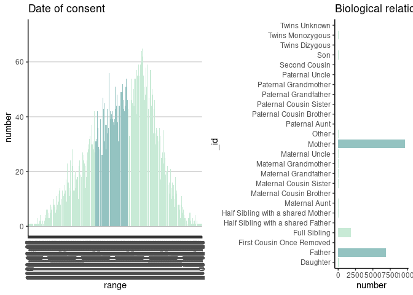

# cloudos 

<!-- README.md is generated from README.Rmd. Please edit that file -->


<!-- badges: start -->
[](https://www.tidyverse.org/lifecycle/#experimental)
[](https://github.com/lifebit-ai/cloudos/actions)
<!-- badges: end -->

**cloudos** R package makes it easy to interact with Lifebit's CloudOS <https://cloudos.lifebit.ai/> platform in the R environment.

## Installation

You can install the released version of **cloudos** from [GitHub](https://github.com/lifebit-ai/cloudos/) at this moment. (Will be listed on  [CRAN](https://CRAN.R-project.org) as well)


```r
if (!require(remotes)) { install.packages("remotes") }
  remotes::install_github("lifebit-ai/cloudos")
```

## Usage

Bellow are given the demonstration of how the **cloudos** package can be used.

### Load the library


```r
library(cloudos)
#> 
#> Welcome to Lifebit's CloudOS R client 
#> For Documentation visit - http://lifebit-ai.github.io/cloudos 
#> This package is under activate development. If you found any issues, 
#> Please reach out here - https://github.com/lifebit-ai/cloudos/issues
library(knitr) # For better visualization of wide dataframes in this README examples
library(magrittr) # For pipe
```

### Configure CloudOS

The cloudos functions will be need set of cloudos configurations for able to connect to API. Lets see different ways of R package will try to find those configurations.

1. From Environment variable
2. From cloudos configuration file

First thing this R-package will look for environment variables - `CLOUDOS_BASEURL`, `CLOUDOS_TOKEN`, `CLOUDOS_TEAMID` and if not found it will try to read from `~/.cloudos/config`.

Three ways to set cloudos environment variables

1. Add them to `~/.Renviron`, which will load the environment variables on beginning of the R-session
2. Add them using `Sys.setenv(ENV_VAR = "env_var_value")`
2. Use the function `cloudos_configure()`, which will create a `~/.cloudos/config` (Recommended way if you using multiple cloudos clients)


## Application - Cohort Browser

Cohort Browser is part of Lifebit's cloudos offering. Lets explore how to interact with this in R environment.

### List Cohorts

To check list of available cohorts in a workspace.


```r
cohorts <- cb_list_cohorts()
#> Total number of cohorts found-78. But here shows-10 as default. For more, change size = 78 to get all.
cohorts %>% head(n=5) %>% kable()
```


|id                       |name            |description      | number_of_participants| number_of_filters|created_at               |updated_at               |
|:------------------------|:---------------|:----------------|----------------------:|-----------------:|:------------------------|:------------------------|
|5fd9da48e3da655a4836e0aa |damian3         |                 |                  44667|                 0|2020-12-16T09:58:32.942Z |2020-12-16T09:58:32.942Z |
|5fd8c234e34ec6186fe45d35 |Test Alberto 53 |Test description |                      4|                11|2020-12-15T14:03:32.394Z |2020-12-16T17:01:27.225Z |
|5fd88a13afc7200a2965d282 |Test Alberto 52 |Test description |                   2884|                 2|2020-12-15T10:04:03.684Z |2020-12-15T10:04:03.684Z |
|5fd88972fb156109dbf8b9d4 |Test Alberto 51 |Test description |                   2884|                 2|2020-12-15T10:01:22.801Z |2020-12-15T10:01:22.801Z |
|5fd888db775c6a099fdf6636 |Test Alberto 50 |Test description |                   2884|                 2|2020-12-15T09:58:51.433Z |2020-12-15T09:58:51.433Z |

### Create a cohort

To create a new cohort. 


```r
my_cohort <- cb_create_cohort(cohort_name = "Cohort-R",
                             cohort_desc = "This cohort is for testing purpose, created from R.")
my_cohort
```

### Get a cohort

Get a available cohort in to a cohort R object. This cohort object can be used in many different other functions.


```r
my_cohort <- cb_load_cohort(cohort_id = "5f9af3793dd2dc6091cd17cd")
my_cohort
#> Cohort ID:  5f9af3793dd2dc6091cd17cd 
#> Cohort Name:  cb_demo_new 
#> Cohort Description:   
#> Number of filters applied:  2
```

### Get samples table

Get all the samples (participants) table for a cohort with phenotypic filters applied.


```r
cohort_samples <- cb_get_samples_table(cohort = my_cohort)
cohort_samples %>% head(n=5) %>% kable()
```


|EID     |Programme     |Year of birth |Participant ethnic category                 |Participant karyotypic sex |Participant type |Acute flag |Biological relationship to proband |
|:-------|:-------------|:-------------|:-------------------------------------------|:--------------------------|:----------------|:----------|:----------------------------------|
|1000020 |Rare Diseases |1970          |Not Stated                                  |Unknown                    |Relative         |Mother     |NULL                               |
|1000522 |Rare Diseases |1990          |White: Any other White background           |Not Supplied               |Relative         |Mother     |NULL                               |
|100079  |Rare Diseases |1967          |White: British                              |Not Supplied               |Relative         |Mother     |NULL                               |
|100084  |Rare Diseases |1953          |Other Ethnic Groups: Any other ethnic group |Not Supplied               |Relative         |Mother     |NULL                               |
|1001429 |Rare Diseases |1981          |White: British                              |Not Supplied               |Relative         |Mother     |NULL                               |

### Get genotypic table

Get all the genotypic table for a cohort.


```r
#cohort_genotype <- cb_get_genotypic_table(my_cohort)
cohort_genotype <- cb_get_genotypic_table(cohort = my_cohort)
#> Total number of rows found 805357 You can use 'size' to mention how many rows you want to extract. Default size = 10
cohort_genotype %>% head(n=5) %>% kable()
```


|Chromosome |Location |Reference |Alternative |Affimetrix ID |Possible allele combination 0 |Possible allele combination 1 |Possible allele combination 2 |index |Type      |id |cn         |NA          |NA.1        |NA.2              |NA.3              |NA.4    |NA.5            |NA.6   |NA.7        |NA.8        |NA.9      |NA.10       |NA.11 |NA.12 |NA.13                                                                                                                                                                                                                                                                                                                                                                                                                                                                                                                                                                                                                                                                                                                                                                                                                                                                                                                                                                                                                                                                                                                                                                                                                                                                                                                                                                                                                                                                                                          |NA.14 |NA.15                               |NA.16 |NA.17 |NA.18 |NA.19 |NA.20 |NA.21 |NA.22 |NA.23 |NA.24 |NA.25 |NA.26  |NA.27 |NA.28  |NA.29  |NA.30  |NA.31 |NA.32  |NA.33  |NA.34 |NA.35  |NA.36 |NA.37 |
|:----------|:--------|:---------|:-----------|:-------------|:-----------------------------|:-----------------------------|:-----------------------------|:-----|:---------|:--|:----------|:-----------|:-----------|:-----------------|:-----------------|:-------|:---------------|:------|:-----------|:-----------|:---------|:-----------|:-----|:-----|:--------------------------------------------------------------------------------------------------------------------------------------------------------------------------------------------------------------------------------------------------------------------------------------------------------------------------------------------------------------------------------------------------------------------------------------------------------------------------------------------------------------------------------------------------------------------------------------------------------------------------------------------------------------------------------------------------------------------------------------------------------------------------------------------------------------------------------------------------------------------------------------------------------------------------------------------------------------------------------------------------------------------------------------------------------------------------------------------------------------------------------------------------------------------------------------------------------------------------------------------------------------------------------------------------------------------------------------------------------------------------------------------------------------------------------------------------------------------------------------------------------------|:-----|:-----------------------------------|:-----|:-----|:-----|:-----|:-----|:-----|:-----|:-----|:-----|:-----|:------|:-----|:------|:------|:------|:-----|:------|:------|:-----|:------|:-----|:-----|
|10         |10:93190 |AC        |            |80278591      |GAC G                         |0 0                           |G GAC                         |0     |Insertion |1  |zzg_m_10_0 |NA          |NA          |NA                |NA                |NA      |NA              |NA     |NA          |NA          |NA        |NA          |NA    |NA    |NA                                                                                                                                                                                                                                                                                                                                                                                                                                                                                                                                                                                                                                                                                                                                                                                                                                                                                                                                                                                                                                                                                                                                                                                                                                                                                                                                                                                                                                                                                                             |NA    |NA                                  |NA    |NA    |NA    |NA    |NA    |NA    |NA    |NA    |NA    |NA    |NA     |NA    |NA     |NA     |NA     |NA    |NA     |NA     |NA    |NA     |NA    |NA    |
|10         |10:93502 |C         |G           |52134431      |C C                           |0 0                           |G C                           |1     |SNP       |2  |zzg_m_10_1 |rs201177578 |Deleterious |Possibly Damaging |Possibly Damaging |Unknown |Disease Causing |Medium |Deleterious |Deleterious |Tolerated |Deleterious |542   |244   |GO CYTOSKELETON ORGANIZATION&#124; GO OOGENESIS&#124; GO MICROTUBULE BASED PROCESS&#124; GO MICROTUBULE CYTOSKELETON ORGANIZATION&#124; GO SEXUAL REPRODUCTION&#124; GO ATOMICAL STRUCTURE MATURATION&#124; GO MITOTIC CELL CYCLE&#124; GO ORGANELLE FISSION&#124; GO CELL MATURATION&#124; GO ORGANELLE ASSEMBLY&#124; GO CELLULAR PROCESS INVOLVED IN REPRODUCTION IN MULTICELLULAR ORGANISM&#124; GO OOCYTE MATURATION&#124; GO OOCYTE DIFFERENTIATION&#124; GO MEIOTIC CELL CYCLE&#124; GO CELL CYCLE&#124; GO MULTI ORGANISM REPRODUCTIVE PROCESS&#124; GO GAMETE GENERATION&#124; GO FEMALE GAMETE GENERATION&#124; GO DEVELOPMENTAL PROCESS INVOLVED IN REPRODUCTION&#124; GO MEIOTIC CELL CYCLE PROCESS&#124; GO SPINDLE ASSEMBLY&#124; GO REPRODUCTION&#124; GO GERM CELL DEVELOPMENT&#124; GO MULTICELLULAR ORGANISM REPRODUCTION&#124; GO DEVELOPMENTAL MATURATION&#124; GO CELL CYCLE PROCESS&#124; GO MICROTUBULE CYTOSKELETON&#124; GO CYTOSKELETAL PART&#124; GO MICROTUBULE&#124; GO SPINDLE&#124; GO GTPASE ACTIVITY&#124; GO HYDROLASE ACTIVITY ACTING ON ACID ANHYDRIDES&#124; GO GUANYL NUCLEOTIDE BINDING&#124; GO RIBONUCLEOTIDE BINDING&#124; GO STRUCTURAL CONSTITUENT OF CYTOSKELETON&#124; GO STRUCTURAL MOLECULE ACTIVITY&#124; GO MEIOTIC SPINDLE ORGANIZATION&#124; GO SPINDLE ORGANIZATION&#124; GO FEMALE MEIOTIC NUCLEAR DIVISION&#124; GO SPINDLE ASSEMBLY INVOLVED IN MEIOSIS&#124; GO MEIOTIC SPINDLE&#124; GO SUPRAMOLECULAR COMPLEX&#124; GO POLYMERIC CYTOSKELETAL FIBER |TUBB8 |TUBB8:NM 177987:exon4:cG830C:pG277A |0.002 |0.787 |0.598 |0.001 |1     |2.155 |-1.84 |-4.65 |0.41  |0.877 |-0.012 |0.561 |NA     |NA     |NA     |NA    |NA     |NA     |NA    |NA     |NA    |NA    |
|10         |10:93635 |T         |C           |3729558       |T T                           |0 0                           |C T                           |2     |SNP       |3  |zzg_m_10_2 |rs200242637 |Deleterious |Benign            |Benign            |Unknown |Disease Causing |Medium |Tolerated   |Deleterious |Tolerated |Tolerated   |615   |27    |GO CYTOSKELETON ORGANIZATION&#124; GO OOGENESIS&#124; GO MICROTUBULE BASED PROCESS&#124; GO MICROTUBULE CYTOSKELETON ORGANIZATION&#124; GO SEXUAL REPRODUCTION&#124; GO ATOMICAL STRUCTURE MATURATION&#124; GO MITOTIC CELL CYCLE&#124; GO ORGANELLE FISSION&#124; GO CELL MATURATION&#124; GO ORGANELLE ASSEMBLY&#124; GO CELLULAR PROCESS INVOLVED IN REPRODUCTION IN MULTICELLULAR ORGANISM&#124; GO OOCYTE MATURATION&#124; GO OOCYTE DIFFERENTIATION&#124; GO MEIOTIC CELL CYCLE&#124; GO CELL CYCLE&#124; GO MULTI ORGANISM REPRODUCTIVE PROCESS&#124; GO GAMETE GENERATION&#124; GO FEMALE GAMETE GENERATION&#124; GO DEVELOPMENTAL PROCESS INVOLVED IN REPRODUCTION&#124; GO MEIOTIC CELL CYCLE PROCESS&#124; GO SPINDLE ASSEMBLY&#124; GO REPRODUCTION&#124; GO GERM CELL DEVELOPMENT&#124; GO MULTICELLULAR ORGANISM REPRODUCTION&#124; GO DEVELOPMENTAL MATURATION&#124; GO CELL CYCLE PROCESS&#124; GO MICROTUBULE CYTOSKELETON&#124; GO CYTOSKELETAL PART&#124; GO MICROTUBULE&#124; GO SPINDLE&#124; GO GTPASE ACTIVITY&#124; GO HYDROLASE ACTIVITY ACTING ON ACID ANHYDRIDES&#124; GO GUANYL NUCLEOTIDE BINDING&#124; GO RIBONUCLEOTIDE BINDING&#124; GO STRUCTURAL CONSTITUENT OF CYTOSKELETON&#124; GO STRUCTURAL MOLECULE ACTIVITY&#124; GO MEIOTIC SPINDLE ORGANIZATION&#124; GO SPINDLE ORGANIZATION&#124; GO FEMALE MEIOTIC NUCLEAR DIVISION&#124; GO SPINDLE ASSEMBLY INVOLVED IN MEIOSIS&#124; GO MEIOTIC SPINDLE&#124; GO SUPRAMOLECULAR COMPLEX&#124; GO POLYMERIC CYTOSKELETAL FIBER |TUBB8 |TUBB8:NM 177987:exon4:cA697G:pM233V |0.012 |0.01  |0.043 |0     |1     |2.105 |-0.18 |-3.33 |0.098 |0.713 |-0.829 |0.183 |0.0279 |0.0174 |0.0196 |0.04  |0.0194 |0.0573 |0.028 |0.0461 |NA    |NA    |
|10         |10:94514 |CTGG      |            |52349171      |CCTGG CCT                     |C CCTGG                       |0 0                           |3     |Insertion |4  |zzg_m_10_3 |NA          |NA          |NA                |NA                |NA      |NA              |NA     |NA          |NA          |NA        |NA          |NA    |NA    |NA                                                                                                                                                                                                                                                                                                                                                                                                                                                                                                                                                                                                                                                                                                                                                                                                                                                                                                                                                                                                                                                                                                                                                                                                                                                                                                                                                                                                                                                                                                             |NA    |NA                                  |NA    |NA    |NA    |NA    |NA    |NA    |NA    |NA    |NA    |NA    |NA     |NA    |NA     |NA     |NA     |NA    |NA     |NA     |NA    |NA     |NA    |NA    |
|10         |10:94693 |G         |            |80278592      |AG                            |0 0                           |A A                           |4     |SNP       |5  |zzg_m_10_4 |NA          |NA          |NA                |NA                |NA      |NA              |NA     |NA          |NA          |NA        |NA          |NA    |NA    |GO CYTOSKELETON ORGANIZATION&#124; GO OOGENESIS&#124; GO MICROTUBULE BASED PROCESS&#124; GO MICROTUBULE CYTOSKELETON ORGANIZATION&#124; GO SEXUAL REPRODUCTION&#124; GO ATOMICAL STRUCTURE MATURATION&#124; GO MITOTIC CELL CYCLE&#124; GO ORGANELLE FISSION&#124; GO CELL MATURATION&#124; GO ORGANELLE ASSEMBLY&#124; GO CELLULAR PROCESS INVOLVED IN REPRODUCTION IN MULTICELLULAR ORGANISM&#124; GO OOCYTE MATURATION&#124; GO OOCYTE DIFFERENTIATION&#124; GO MEIOTIC CELL CYCLE&#124; GO CELL CYCLE&#124; GO MULTI ORGANISM REPRODUCTIVE PROCESS&#124; GO GAMETE GENERATION&#124; GO FEMALE GAMETE GENERATION&#124; GO DEVELOPMENTAL PROCESS INVOLVED IN REPRODUCTION&#124; GO MEIOTIC CELL CYCLE PROCESS&#124; GO SPINDLE ASSEMBLY&#124; GO REPRODUCTION&#124; GO GERM CELL DEVELOPMENT&#124; GO MULTICELLULAR ORGANISM REPRODUCTION&#124; GO DEVELOPMENTAL MATURATION&#124; GO CELL CYCLE PROCESS&#124; GO MICROTUBULE CYTOSKELETON&#124; GO CYTOSKELETAL PART&#124; GO MICROTUBULE&#124; GO SPINDLE&#124; GO GTPASE ACTIVITY&#124; GO HYDROLASE ACTIVITY ACTING ON ACID ANHYDRIDES&#124; GO GUANYL NUCLEOTIDE BINDING&#124; GO RIBONUCLEOTIDE BINDING&#124; GO STRUCTURAL CONSTITUENT OF CYTOSKELETON&#124; GO STRUCTURAL MOLECULE ACTIVITY&#124; GO MEIOTIC SPINDLE ORGANIZATION&#124; GO SPINDLE ORGANIZATION&#124; GO FEMALE MEIOTIC NUCLEAR DIVISION&#124; GO SPINDLE ASSEMBLY INVOLVED IN MEIOSIS&#124; GO MEIOTIC SPINDLE&#124; GO SUPRAMOLECULAR COMPLEX&#124; GO POLYMERIC CYTOSKELETAL FIBER |TUBB8 |NA                                  |NA    |NA    |NA    |NA    |NA    |NA    |NA    |NA    |NA    |NA    |NA     |NA    |NA     |NA     |NA     |NA    |NA     |NA     |NA    |NA     |NA    |NA    |

### Explore Filters

#### Search phenotypic filters

Search for phenotypic filters based on a term.


```r
all_filters <- cb_search_phenotypic_filters(term = "cancer")
#> Total number of phenotypic filters found - 4
all_filters %>% head(n=5) %>% kable()
```


|bucket500 |bucket1000 |bucket2500 |bucket5000 |bucket300 |bucket10000 |categoryPathLevel1 |categoryPathLevel2  |id  |instances |name                             |type        |Sorting |valueType            |units |coding |description                                                                                                                                                                                                                                                                                  |descriptionParticipantsNo |link                                                            |array |descriptionStability |descriptionCategoryID |descriptionItemType |descriptionStrata   |descriptionSexed |orderPhenotype |instance0Name |instance1Name |instance2Name |instance3Name |instance4Name |instance5Name |instance6Name |instance7Name |instance8Name |instance9Name |instance10Name |instance11Name |instance12Name |instance13Name |instance14Name |instance15Name |instance16Name |
|:---------|:----------|:----------|:----------|:---------|:-----------|:------------------|:-------------------|:---|:---------|:--------------------------------|:-----------|:-------|:--------------------|:-----|:------|:--------------------------------------------------------------------------------------------------------------------------------------------------------------------------------------------------------------------------------------------------------------------------------------------|:-------------------------|:---------------------------------------------------------------|:-----|:--------------------|:---------------------|:-------------------|:-------------------|:----------------|:--------------|:-------------|:-------------|:-------------|:-------------|:-------------|:-------------|:-------------|:-------------|:-------------|:-------------|:--------------|:--------------|:--------------|:--------------|:--------------|:--------------|:--------------|
|FALSE     |FALSE      |FALSE      |FALSE      |FALSE     |FALSE       |Cancer             |Participant disease |177 |1         |Cancer disease sub type          |bars        |        |Categorical multiple |      |       |The subtype of the cancer in question, recorded against a limited set of supplied enumerations.                                                                                                                                                                                              |17404                     |https://cnfl.extge.co.uk/pages/viewpage.action?pageId=147659370 |4     |                     |                      |                    |Main 100k Programme |                 |               |              |              |              |              |              |              |              |              |              |              |               |               |               |               |               |               |               |
|FALSE     |FALSE      |FALSE      |FALSE      |FALSE     |FALSE       |Cancer             |Participant disease |178 |1         |Cancer disease type              |bars        |        |Categorical multiple |      |       |The cancer type of the tumour sample submitted to Genomics England.                                                                                                                                                                                                                          |17404                     |https://cnfl.extge.co.uk/pages/viewpage.action?pageId=147659370 |4     |                     |                      |                    |Main 100k Programme |                 |               |              |              |              |              |              |              |              |              |              |              |               |               |               |               |               |               |               |
|FALSE     |FALSE      |FALSE      |FALSE      |FALSE     |FALSE       |Cancer             |Participant Tumour  |190 |1         |Cancer tumour sk                 |text_search |        |Text                 |      |       |Database identifier for a participant's registered tumour                                                                                                                                                                                                                                    |9561                      |https://cnfl.extge.co.uk/pages/viewpage.action?pageId=147659370 |5     |                     |                      |                    |Main 100k Programme |                 |               |              |              |              |              |              |              |              |              |              |              |               |               |               |               |               |               |               |
|FALSE     |FALSE      |FALSE      |FALSE      |FALSE     |FALSE       |Cancer             |Participant Tumour  |272 |1         |Pancreatic cancer clinical stage |bars        |        |Categorical multiple |      |       |COSD UG14560, UPPER GI - STAGING - PANCREAS. Description: 'Clinically agreed stage based on radiological findings of tumour extent in order to offer treatment recommendations. The category selected depends on tumour location within the pancreas and the arterial or venous involvement. |9561                      |https://cnfl.extge.co.uk/pages/viewpage.action?pageId=147659370 |5     |                     |                      |                    |Main 100k Programme |                 |               |              |              |              |              |              |              |              |              |              |              |               |               |               |               |               |               |               |
Lets choose one filter from above table


```r
# apply this first row filter
my_phenotypic_filter <- all_filters[1,]
my_phenotypic_filter %>% kable()
```


|bucket500 |bucket1000 |bucket2500 |bucket5000 |bucket300 |bucket10000 |categoryPathLevel1 |categoryPathLevel2  |id  |instances |name                    |type |Sorting |valueType            |units |coding |description                                                                                      |descriptionParticipantsNo |link                                                            |array |descriptionStability |descriptionCategoryID |descriptionItemType |descriptionStrata   |descriptionSexed |orderPhenotype |instance0Name |instance1Name |instance2Name |instance3Name |instance4Name |instance5Name |instance6Name |instance7Name |instance8Name |instance9Name |instance10Name |instance11Name |instance12Name |instance13Name |instance14Name |instance15Name |instance16Name |
|:---------|:----------|:----------|:----------|:---------|:-----------|:------------------|:-------------------|:---|:---------|:-----------------------|:----|:-------|:--------------------|:-----|:------|:------------------------------------------------------------------------------------------------|:-------------------------|:---------------------------------------------------------------|:-----|:--------------------|:---------------------|:-------------------|:-------------------|:----------------|:--------------|:-------------|:-------------|:-------------|:-------------|:-------------|:-------------|:-------------|:-------------|:-------------|:-------------|:--------------|:--------------|:--------------|:--------------|:--------------|:--------------|:--------------|
|FALSE     |FALSE      |FALSE      |FALSE      |FALSE     |FALSE       |Cancer             |Participant disease |177 |1         |Cancer disease sub type |bars |        |Categorical multiple |      |       |The subtype of the cancer in question, recorded against a limited set of supplied enumerations.  |17404                     |https://cnfl.extge.co.uk/pages/viewpage.action?pageId=147659370 |4     |                     |                      |                    |Main 100k Programme |                 |               |              |              |              |              |              |              |              |              |              |              |               |               |               |               |               |               |               |

#### Apply phenotypic filter

We can get statistic of sample numbers in a cohort for which a filter is applied.


```r
# phenotype filter
cohort_with_filters <- cb_get_filter_statistics(cohort = my_cohort, 
                                     filter_id = my_phenotypic_filter$id)
cohort_with_filters %>% head(n=10) %>% kable()
```


|_id                                 | number| total|
|:-----------------------------------|------:|-----:|
|(All) Acute Lymphoblastic Leukaemia |     46|  4449|
|(Aml) Acute Myeloid Leukaemia       |     55|  4449|
|Acral Lentiginous                   |      1|  4449|
|Adamantinoma Of Bone                |      7|  4449|
|Adenocarcinoma                      |    982|  4449|
|Anaplastic Astrocytoma              |     11|  4449|
|Anaplastic Oligodendroglioma        |      5|  4449|
|Angiosarcoma                        |      3|  4449|
|Biliary Adenocarcinoma              |      1|  4449|
|Carcinosarcoma                      |     12|  4449|

We can get number of total participants after applying a filter.


```r
# filter participants
total_participants_with_filter <- cb_filter_participants(cohort = my_cohort, 
                                                filter_id = my_phenotypic_filter$id)
 
total_participants_with_filter
#> $total
#> [1] 44667
#> 
#> $count
#> [1] 0
```

### Apply and Save a filter

Save a filter into the database.

For this a `filter_query` is required.

`filter_query` is a list of different **phenotypic filter** quires.

Steps to find phenotypic filters - 

- Use `cb_search_phenotypic_filters()` to find a filter based on a term.
- At this time you will be having phenotypic filter id of your choice.
- Check the available filter values/range using `cb_get_filter_statistics()`
- Now use this information to make your `filter_query`

There are two possible type of `filter_query`

- Range based
- Value based

**Range based**

For filter_id = 22


```r
# A tibble: 1,880 x 3
   `_id`      number total
   <chr>       <int> <int>
 1 1938-12-25      1 44660
 2 1998-07-07      1 44660
 3 2000-12-04      1 44660
 4 2003-12-24      1 44660
 5 2004-07-20      1 44660
 6 2004-10-21      1 44660
 7 2004-11-01      1 44660
 8 2004-11-03      1 44660
 9 2005-01-07      1 44660
10 2005-02-27      1 44660
# … with 1,870 more rows
```

To make a range based query - `filter_query = list("22" = list("from" = "2015-05-13", "to" = "2016-04-29")`

Here `"22"` is the filter_id and you need to provide the range as a list with `from` and `to`.

**Value based**

For filter_id = 50


```r
# A tibble: 25 x 3
   `_id`                             number total
   <chr>                              <int> <int>
 1 Daughter                             135 19187
 2 Father                              6864 19187
 3 First Cousin Once Removed             11 19187
 4 Full Sibling                        1876 19187
 5 Half Sibling with a shared Father      4 19187
 6 Half Sibling with a shared Mother     79 19187
 7 Maternal Aunt                         49 19187
 8 Maternal Cousin Brother               12 19187
 9 Maternal Cousin Sister                34 19187
10 Maternal Grandfather                  36 19187
11 Maternal Grandmother                  68 19187
12 Maternal Uncle                        27 19187
13 Mother                              9649 19187
14 Other                                114 19187
```

To make a value based query <- `filter_query = list("50" = c("Father", "Mother"))`

Here `"50"` is filter_id and `c("Father", "Mother")` is a vector of values. 

If you have multiple `filter_query` you can combine them with separated by a coma `,` inside the list. Such as `filter_query = list(filter_query_1, filter_query_2)`

Check the bellow example for the complete function call.


```r
cb_apply_filter(cohort = my_cohort,
                filter_query = list("22" = list("from" = "2015-05-13", "to" = "2016-04-29"),
                                    "50" = c("Father", "Mother")))

```

### Get sample filters plot (experimental)

Get ggplots for all the applied phenotypic filters for a cohort. 

As this based on ggplot objects, this can be customised further. 


```r
plot_list <- cb_plot_filters(cohort = my_cohort)
#> Warning: Ignoring unknown parameters: binwidth, bins, pad
library(ggpubr)
#> Loading required package: ggplot2
ggpubr::ggarrange(plotlist = plot_list)
```



Individual plots


```r
plot_list[[1]]
```


```r
plot_list[[2]]
```


Covert ggplot objects to plotly elements (just for demonstration purpose, in markdown plotly don't support.)


```r
p1 <- plotly::ggplotly(plot_list$filter_id_34)
p1
```


```r
p2 <- plotly::ggplotly(plot_list$filter_id_2345)
p2
```

## Additional notes

This package is under activate development. If you found any issues, Please reach out here - https://github.com/lifebit-ai/cloudos/issues 

For Documentation visit - http://lifebit-ai.github.io/cloudos 

## License

MIT © [Lifebit](https://lifebit.ai/)
